# Heurísticas de Jakob Nielsen

### 1 - Visibilidade do status estamos no sistema

O sistema deve sempre manter os usuários informados sobre o que está acontecendo, em tempo real, por meio de feedbacks instantâneos dentro de um prazo razoável, que servirão para orientar o usuário sobre o que está acontecendo na tela em que ele se encontra.

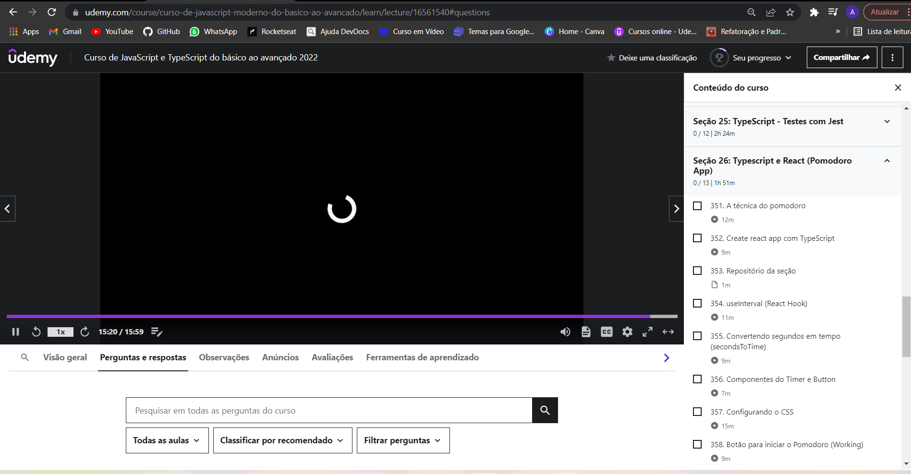

Quando estudamos um curso on-line, somos informados de tudo que ocorre na tela, como a barra do player que mostra o quanto do vídeo já foi carregado, em qual parte o vídeo está, o tempo de duração dele, o quanto já foi assistido, do lado direito fica claro qual vídeo está sendo reproduzido, quais já foram assistidos e quais os próximos.

### 2 - Correspondencia entre sistema e mundo realizar

O sistema deve ter a mesma linguagem que seu usuário utiliza no dia a dia, portanto utilizar palavras, frases, imagens e conceitos que sejam familiares ao usuário. Também é recomendável a utilização de ícones que representem uma ação para realizar essa correspondência.

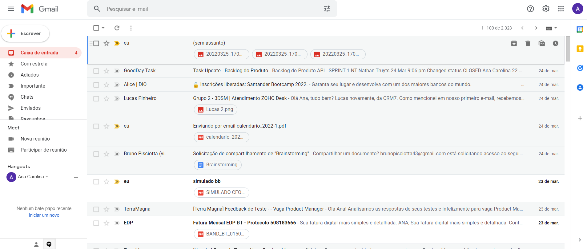 

Por exemplo, o símbolo de uma lixeira representa a ação de excluir algo, o de lupa a de buscar, representando assim ações que tenham uma conexão com o mundo real.

### 3 - Controle e liberdade para o usuário

No sistema é importante que o usuário tenha liberdade para realizar ações que ele deseja, porém muitas vezes essas ações são realizadas por engano, nessas situações deve haver uma “saída de emergência” de fácil localização, permitindo que o usuário saia daquela janela indesejada ou retorne ao ponto anterior.

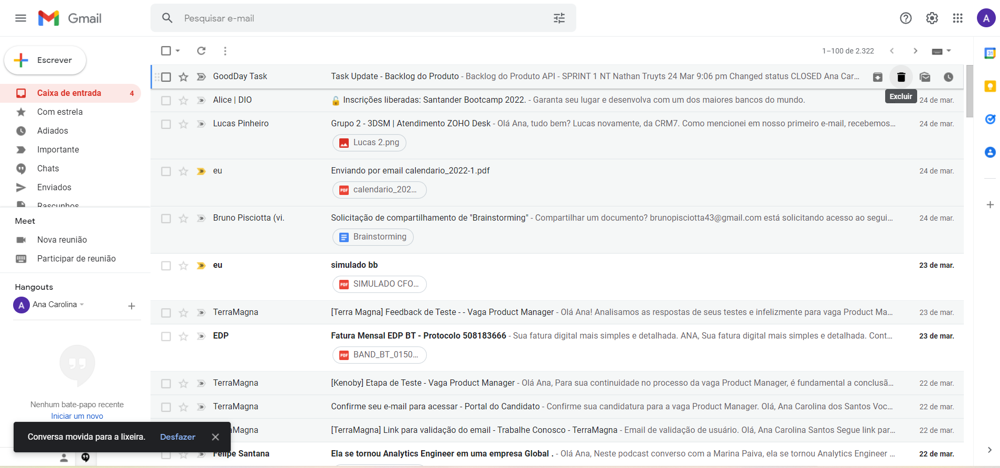

O Gmail, por exemplo, permite que o usuário desfaça a ação de excluir um e-mail, portanto a caixa com a opção “desfazer” permite que o usuário se recupere, dando a ele controle sobre a situação, caso ela tenha sido realizada por engano.

### 4 - Consistência e padronização

Não devemos deixar o usuário em dúvida se palavras, situações ou ações diferentes tem o mesmo significado, para isso a interface deve manter uma consistência, permitindo que o usuário identifique os padrões de estética, interação e informação existentes nesta.

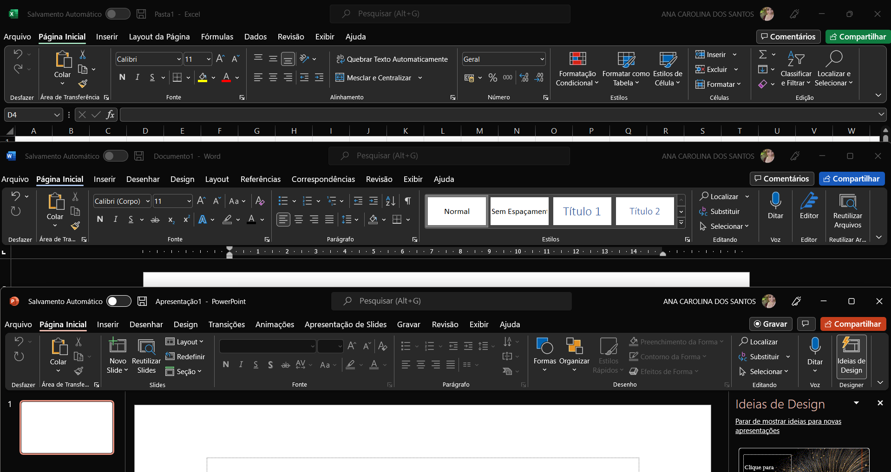

Os programas da Microsoft, por exemplo, seguem padrões, sendo que os itens do menu ficam sempre na parte superior, os ícones que realizam a mesma ação são repetidos em todas as interfaces, como os da seção Clipboard, em que a tipografia é a mesma e mantém o mesmo tamanho e cor.

### 5 - Prevenções de erros

Essa heurística foca em criar uma plataforma que busca prevenir que problemas ocorram, eliminando condições mais propensas ao erro, isso pode ser feito sinalizando ações como quando o usuário não finalizou uma tarefa e pede para sair da página ou oferecendo a ele uma opção de confirmação antes de completar uma ação.

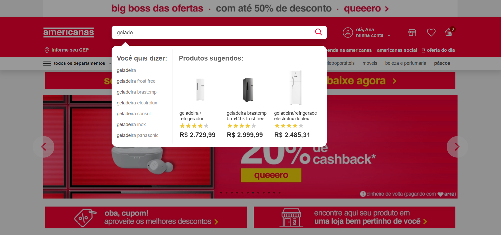

Um exemplo disso é a busca por produtos no site das Lojas Americanas, que mostra, ao digitar uma caixa com varias opções ao usuário, evitando que digite errado e faça uma pesquisa que não localiza o produto.

### 6 - Reconhecer ao invés de lembrar

Devemos minimizar a quantidade de informações que o usuário precisa memorizar, para isso, objetos, ações e opções importantes devem ficar visíveis, isso faz com que o cérebro perceba as ações que são similares, reconhecendo assim padrões.

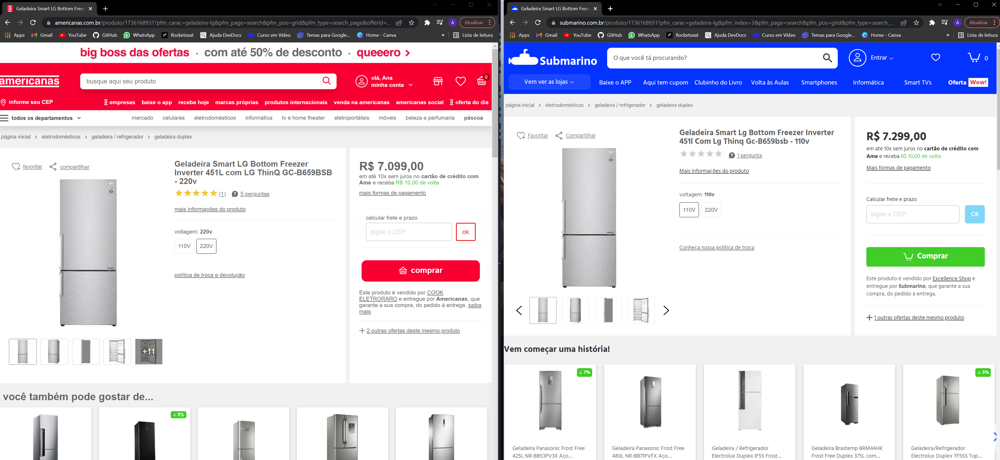

Os sites de e-commerce, por exemplo, costumam seguir padrões em seu layout, tendo a barra de busca no topo, o carrinho no canto superior direito, na página do produto fica uma foto deste a esquerda e sua descrição na direita, permitindo assim que o usuário reconheça o layout de experiências anteriores que ele teve nos demais sites do gênero, focando mais sua atenção nos produtos, do que em aprender a utilizar o site.

### 7 – Eficiência e flexibilidade de uso

A interface deve atender tanto as necessidades dos usuários leigos quanto a dos experientes, os leigos precisam ter as informações bem detalhadas para conseguirem realizar uma tarefa, mas a medida que vão conhecendo a interface precisam conseguir interagir de forma mais rápida, portanto a interface deve permitir que os usuários adaptem ações frequentes de acordo com o nível em que estão.

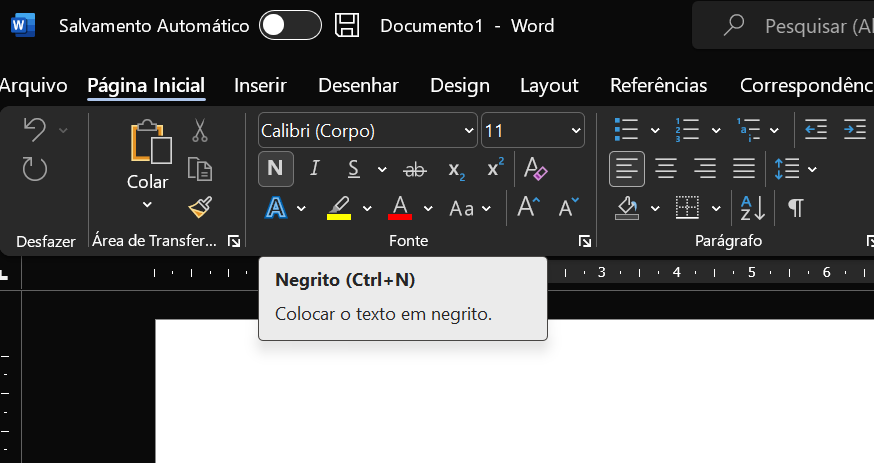

Os atalhos de teclado do Word, por exemplo, permitem essa interação mais rápida, pois reduzem a quantidade de cliques que o usuário precisaria para realizar uma ação, além de diminuir o tempo gasto para achar onde aquela ação está na plataforma, permitindo realizá-la apertando poucas teclas.

### 8 – Estética e design minimalista

Quanto maior a quantidade de informações, mais tempo o usuário vai levar para analisá-las e poder tomar uma decisão, aumentando assim as chances dele abandonar a aplicação/site por achar confuso demais.Portanto o design da interface deve ser minimalista e o conteúdo o mais direto possível, informações que forem secundárias podem ser deixadas em segundo plano, como menus e abas.

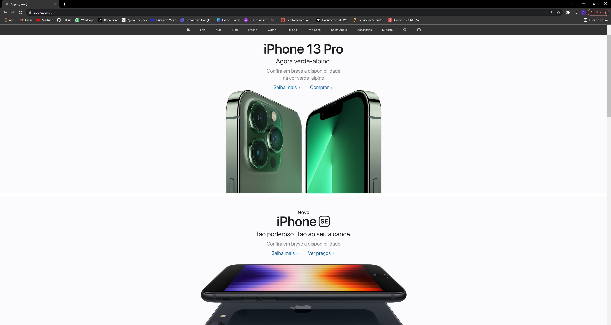

O site da Apple é um bom exemplo de estética e design minimalista, ele é bem simples e objetivo, mostrando o nome do produto, uma linha o descrevendo e a foto dele grande e destacada com cores contrastantes, além disso o site valoriza o espaço em branco, os elementos são bem organizados e a tipografia usada é simples e limpa.

### 9 – Ajude os usuários a reconhecer, diagnosticar e recuperar erros

Caso dê algo de errado, é importante mostrar ao usuário qual foi o erro e como se recuperar dele, para isso, as mensagens de erro devem ser claras e objetivas, em linguagem simples e próximas da ação que causou o erro.

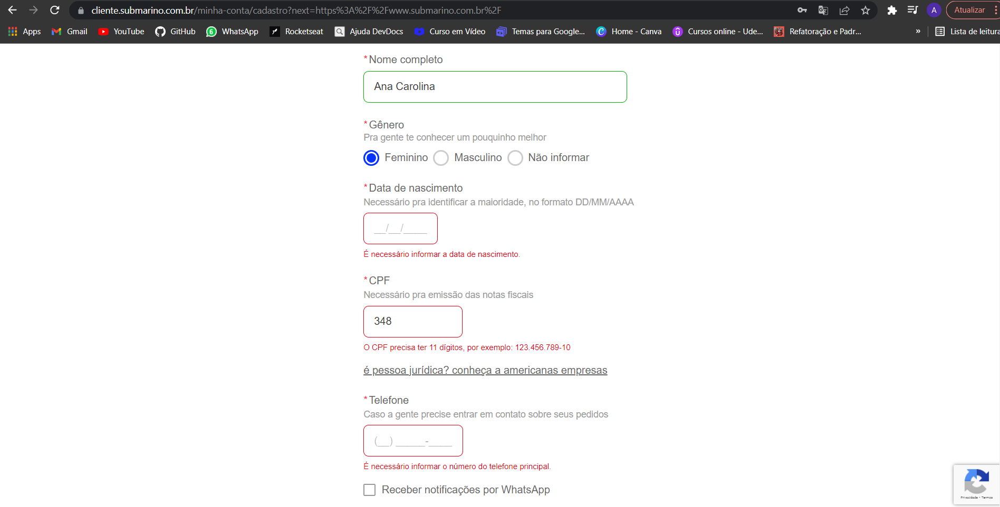

Por exemplo, o formulário de criação de conta do Submarino mostra quando um dado está preenchido incorretamente, no momento de preencher os dados a plataforma orienta onde está o erro, próximo do campo em que ele ocorreu e os passos para corrigi-lo.

### 10 – Ajuda e documentação

Nunca sabemos quando um usuário vai precisar de um auxílio, embora as áreas de documentação e ajuda sejam as menos acessadas, elas devem estar lá, principalmente em interfaces que possuem muitas possibilidades, pois podem ajudar o usuário a resolver um problema sozinho.  

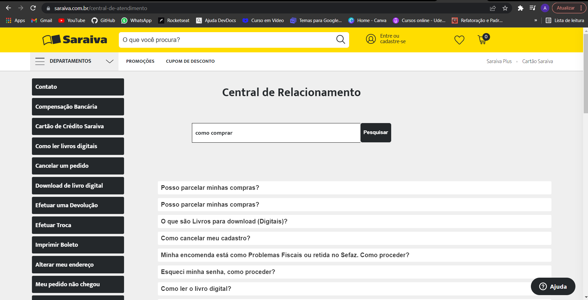

O site da Saraiva, por exemplo, possui um FAQ que permite aos usuários verem as dúvidas mais frequentes e suas respectivas soluções, podendo assim resolver por conta um problema que esteja aqui.  

------------------------------------------------------------------------------------------------

# Diretrizes de Acessibilidade para o Conteúdo da Web - WCAG

## Princípio 1: Perceptível

De acordo com esse princípio, é necessário que os conteúdos sejam apresentados de mais de uma forma. Para isso, uma descrição alternativa das imagens, legendas em vídeos ou outros tipos de multimídia, e um código de HTML que consiga compreender leitores de tela são requisitos.

Com essas medidas, o conteúdo do site não estará sendo transmitido de uma única maneira o que o torna perceptível para um público que antes estaria impossibilitado de acessá-lo.

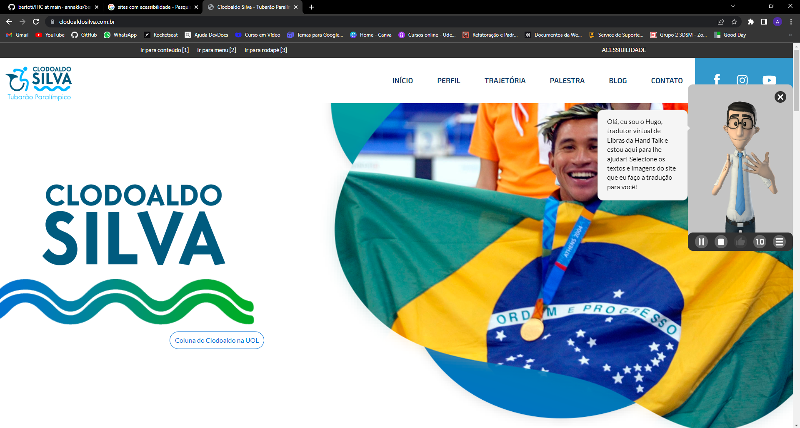

## Princípio 2: Operacional 

Como o próprio nome diz, um site adequadamente operável é aquele em que todos os usuários consigam realizar as diversas operações sem barreiras de acesso. Por isso, é necessário que a codificação de HTML esteja ajustada, a fim de permitir a navegação pelo teclado. Além disso, a velocidade da página deve ser equilibrada: nem muito rápida, nem muito devagar e estruturar os cabeçalhos de forma  organizada também é necessário. Por fim, devem ser evitados o uso de dispositivos que sejam um gatilho para ataques epiléticos: o excesso de cores e iluminação, ou a utilização exagerada de pop-ups costumam ser prejudiciais nesse sentido.

## Princípio 3: Compreensível 

O terceiro princípio diz respeito sobretudo ao conteúdo textual dos sites. Além de uma escolha adequada de fontes, é necessário evitar expressões específicas, escrever sentenças de forma clara e objetiva. Medidas como essa tornam o site acessível sobretudo para pessoas com dislexia ou deficiências intelectuais, mas também podem ser muito úteis para aqueles que não fazem parte de determinado contexto, ou têm dificuldades de leitura por algum motivo.

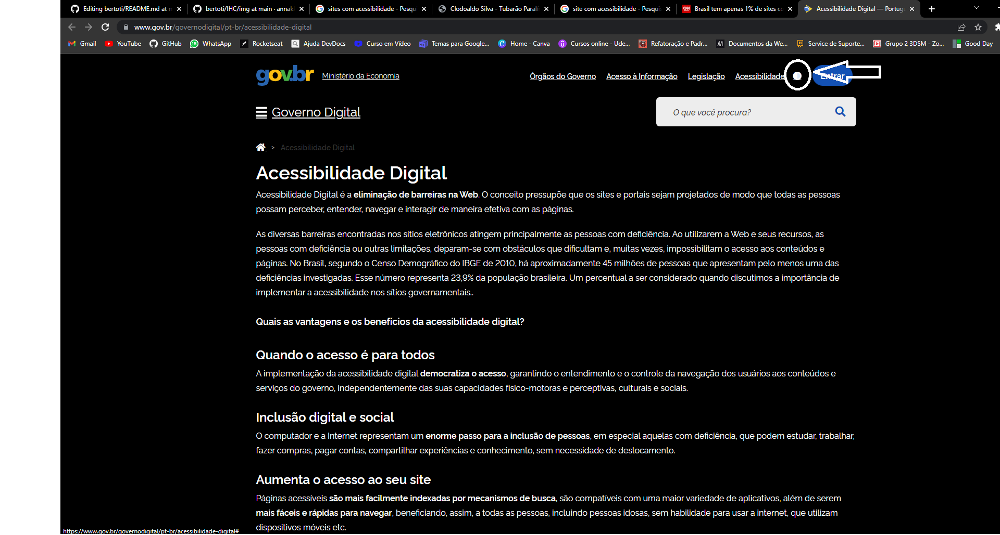

## Princípio 4: Robusto

O último conceito diz respeito à codificação do website. O WCAG estipula que o HTML deve estar alinhado a ponto de estar apto para rodar as tecnologias assistivas existentes e também para tornar o site navegável pelo teclado, o que neste último caso é imprescindível para pessoas com deficiência motora.
 
 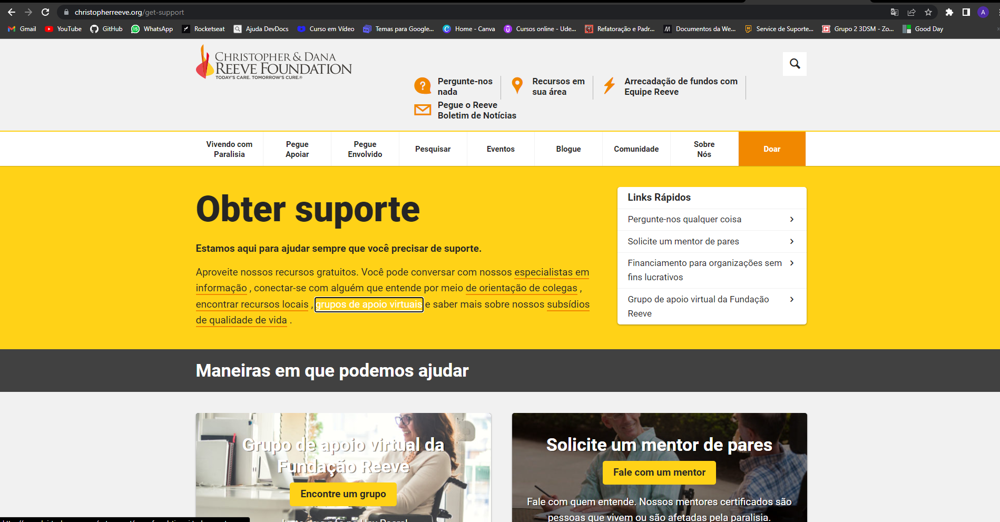
